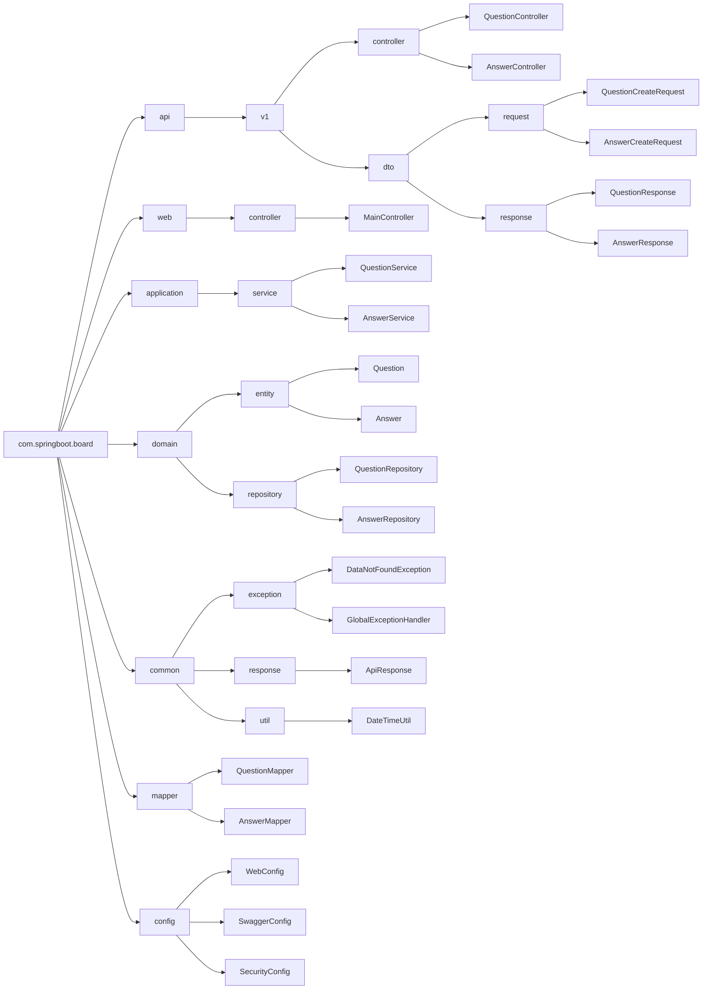
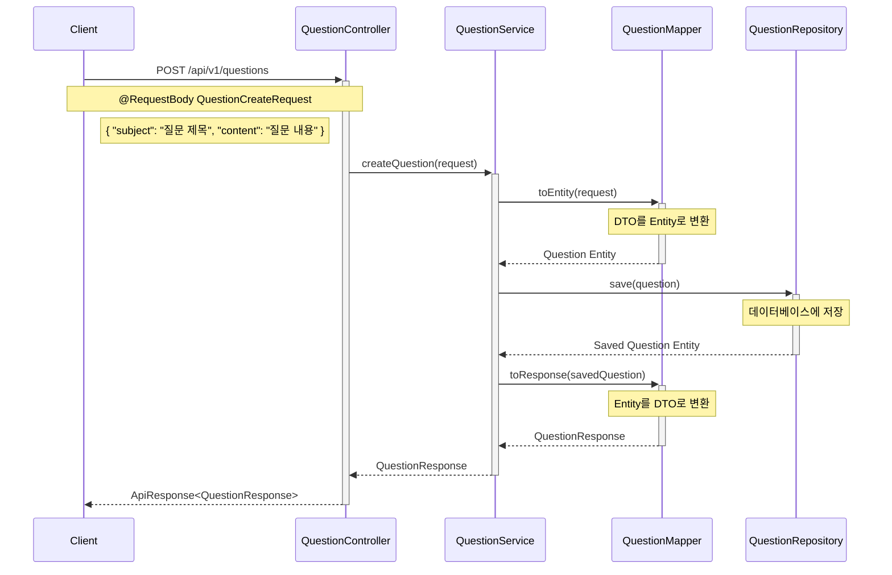
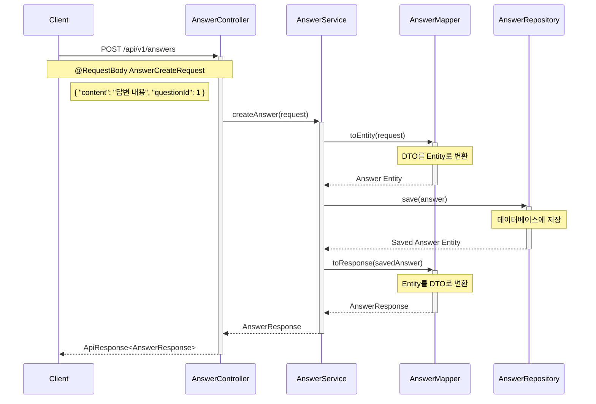

# EZEN Mini 프로젝트 백엔드

## 설명

- Ezen Boot Camp mini 프로젝트 백엔드 파트
- 수업내용을 원본으로 API server 구현 리팩토링
- Vscode , intellij 둘다 사용 가능

## API 문서

- Swagger UI: [http://localhost:8080/swagger-ui/index.html](http://localhost:8080/swagger-ui/index.html)
- API 문서: [http://localhost:8080/v3/api-docs](http://localhost:8080/v3/api-docs)

## 기술 스택

- Java 17
- Spring Boot 3.1.5
- MySQL
- Maven
- Lombok
- Swagger

## 설치 및 실행 방법

1. 필요한 소프트웨어 설치:

   - JDK 17 이상
   - Maven
   - MySQL
   - Postman (필요시)

2. 프로젝트 클론:

   ```bash
   git clone [프로젝트의 Git 저장소 URL]
   ```

3. 의존성 설치:

   ```bash
   # .env 파일 생성해야 빌드가 됨
   cd [프로젝트 디렉토리]
   mvn clean install
   ```

4. 애플리케이션 실행:
   ```bash
   mvn spring-boot:run
   ```

## 패키지 구조



## 패키지 설명

- `api`: REST API 관련 컴포넌트

  - `v1`: API 버전 1
    - `controller`: API 컨트롤러
    - `dto`: 데이터 전송 객체
      - `request`: 요청 DTO
      - `response`: 응답 DTO

- `web`: 웹 MVC 관련 컴포넌트
  - `controller`: 웹 컨트롤러
- `application`: 비즈니스 로직
  - `service`: 서비스 계층
- `domain`: 도메인 모델
  - `entity`: JPA 엔티티
  - `repository`: 데이터 접근 계층
- `common`: 공통 컴포넌트
  - `exception`: 예외 처리
  - `response`: 응답 관련
  - `util`: 유틸리티
- `mapper`: DTO-엔티티 변환
- `config`: 설정 클래스

## Question 시퀀스



<br>
<br>

## Answer 시퀀스


