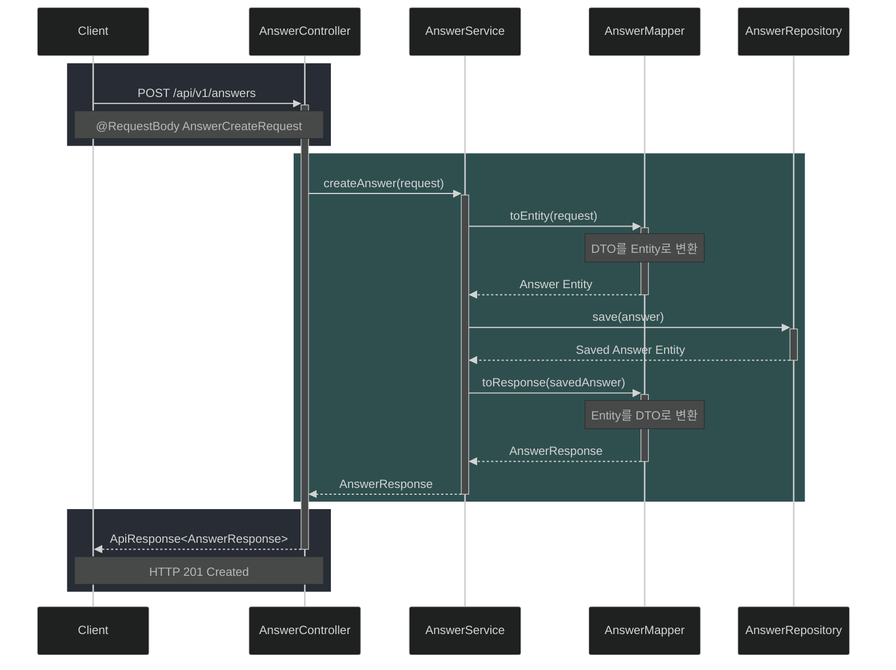

## Answer 시퀀스 다이어그램

```mermaid
%%{init: {'theme': 'dark'}}%%
sequenceDiagram
    participant C as Client
    participant AC as AnswerController
    participant AS as AnswerService
    participant AM as AnswerMapper
    participant AR as AnswerRepository
    
    rect rgb(40, 44, 52)
        C->>+AC: POST /api/v1/answers
        Note over C,AC: @RequestBody AnswerCreateRequest
    end
    
    rect rgb(47, 79, 79)
        AC->>+AS: createAnswer(request)
        
        AS->>+AM: toEntity(request)
        Note over AM: DTO를 Entity로 변환
        AM-->>-AS: Answer Entity
        
        AS->>+AR: save(answer)
        AR-->>-AS: Saved Answer Entity
        
        AS->>+AM: toResponse(savedAnswer)
        Note over AM: Entity를 DTO로 변환
        AM-->>-AS: AnswerResponse
        
        AS-->>-AC: AnswerResponse
    end
    
    rect rgb(40, 44, 52)
        AC-->>-C: ApiResponse<AnswerResponse>
        Note over C,AC: HTTP 201 Created
    end
```

