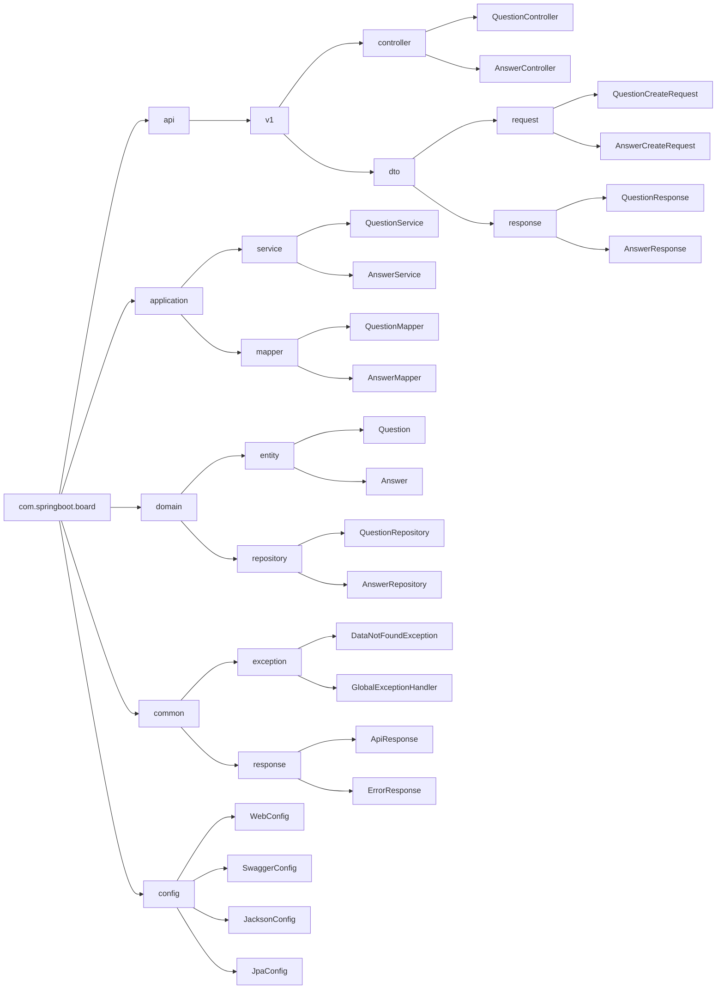
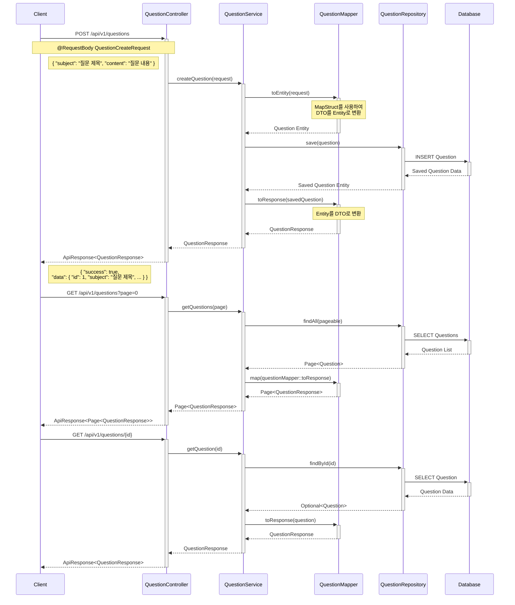
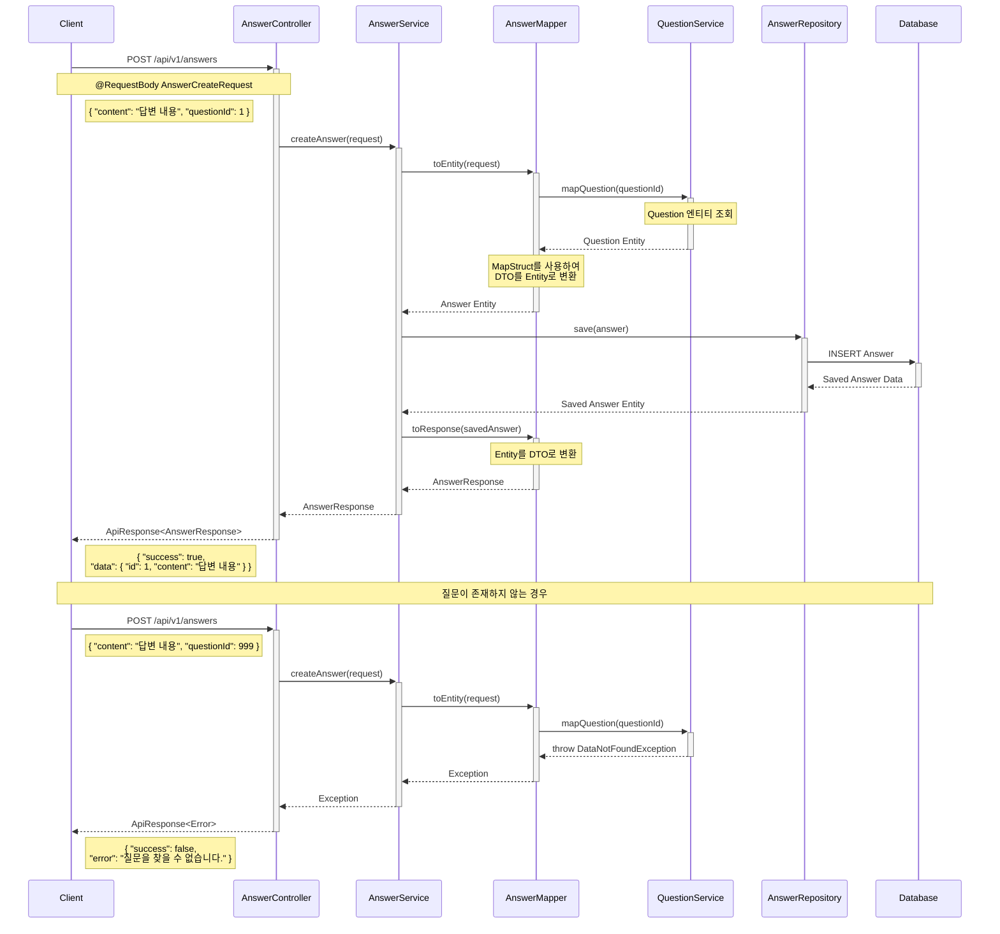

# EZEN Mini 프로젝트 백엔드

### 설명

- Ezen Boot Camp mini 프로젝트 백엔드 파트
- 수업내용을 원본으로 API server 구현 리팩토링
- Vscode , intellij 둘 다 사용 가능
- Spring Boot를 사용한 질문-답변 게시판 API 서버
- RESTful API 설계 원칙 준수
- 표준화된 응답 형식과 에러 처리
- Swagger를 통한 API 문서화
- CICD 구현되어 있습니다. 이 부분 에러는 무시하세요.

### author:

- Ezen A Team

### Verion:

- 2.4.0 (2025-01-05) - 날짜/시간 표기 디버깅 완료
- 2.3.2 (2025-01-05) - cicd 의존성 업데이트.
- 2.3.1 (2025-01-05) - 날짜/시간 표기 디버깅 완료
- 2.3.0 (2025-01-05) - Jackson 파일 날짜표기 한국시간으로 변경
- 2.2.0 (2025-01-05) - 질문 상세조회 시 답변 목록 추가
- 2.1.0 (2025-01-03) - Health Check 추가
- 2.0.1 (2025-01-02) - CICD 구현
- 2.0.0 (2025-01-02) - 표준화로의 노력
- 1.0.0 (2025-01-01) - 기본형

## API 문서 확인

- Swagger UI: [http://localhost:8080/swagger-ui/index.html](http://localhost:8080/swagger-ui/index.html)
- Swagger EC2-UI: http://15.164.186.170:8080/swagger-ui/index.html

- API 문서: [http://localhost:8080/v3/api-docs](http://localhost:8080/v3/api-docs)
- API 문서- EC2: http://15.164.186.170:8080/v3/api-docs
## 기술 스택

- Java 17
- Spring Boot 3.1.5
- MySQL
- Maven
- Lombok
- Swagger (SpringDoc OpenAPI)
- MapStruct

## 설치 및 실행 방법

1. 필요한 소프트웨어 설치:

   - JDK 17 이상
   - Maven
   - MySQL
   - Postman (필요시)

2. 프로젝트 클론:

   ```bash
   git clone https://github.com/joshbae119/ezen-mini-backend.git
   ```

3. 애플리케이션 실행:

   ```bash
   mvn clean install
   mvn spring-boot:run
   ```

4. 의존성 설치 (.env 파일 생성):

   Data Base

   - DB_URL=
   - DB_USERNAME=
   - DB_PASSWORD=

   Jackson Configuration

   - JACKSON_WRITE_DATES_AS_TIMESTAMPS=false
   - JACKSON_FAIL_ON_EMPTY_BEANS=false
   - JACKSON_FAIL_ON_UNKNOWN_PROPERTIES=false
   - JACKSON_DEFAULT_PROPERTY_INCLUSION=NON_NULL

   Timezone

   - TZ=Asia/Seoul

## 패키지 구조



## 패키지 설명

### api

REST API 관련 컴포넌트를 포함

- `v1`: API 버전 1
  - `controller`: REST API 엔드포인트 처리 (QuestionController, AnswerController)
  - `dto`: 데이터 전송 객체
    - `request`: 클라이언트 요청 데이터 (QuestionCreateRequest, AnswerCreateRequest)
    - `response`: 클라이언트 응답 데이터 (QuestionResponse, AnswerResponse)

### application

비즈니스 로직 처리 계층

- `service`: 비즈니스 로직 구현 (QuestionService, AnswerService)
- `mapper`: DTO-Entity 변환 처리 (QuestionMapper, AnswerMapper)

### domain

핵심 비즈니스 로직과 엔티티 정의

- `entity`: JPA 엔티티 클래스 (Question, Answer)
- `repository`: 데이터 접근 계층 (QuestionRepository, AnswerRepository)

### common

공통 유틸리티 및 설정

- `exception`: 예외 처리 관련 클래스 (DataNotFoundException, GlobalExceptionHandler)
- `response`: 표준 응답 형식 정의 (ApiResponse, ErrorResponse)

### config

애플리케이션 설정 클래스

- WebConfig: CORS 설정
- SwaggerConfig: API 문서화 설정
- JacksonConfig: JSON 직렬화 설정
- JpaConfig: JPA 관련 설정

## Question 시퀀스



<br>
<br>

## Answer 시퀀스


