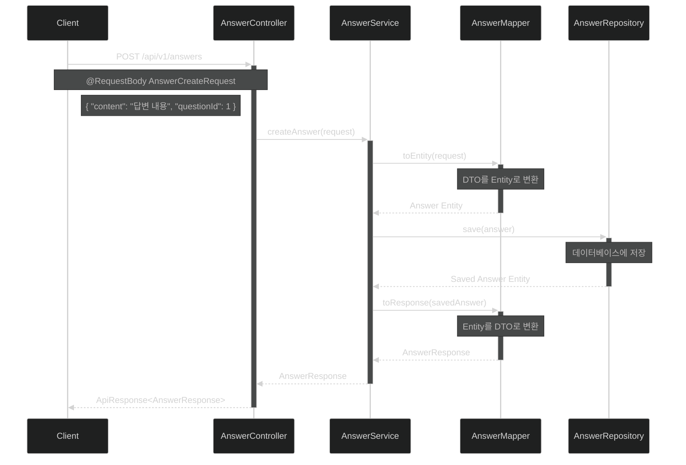

## Answer 데이터 흐름 다이어그램

```mermaid
%%{init: {'theme': 'dark'}}%%
sequenceDiagram
    participant C as Client
    participant AC as AnswerController
    participant AS as AnswerService
    participant AM as AnswerMapper
    participant AR as AnswerRepository
    
    C->>+AC: POST /api/v1/answers
    Note over C,AC: @RequestBody AnswerCreateRequest
    Note right of C: { "content": "답변 내용", "questionId": 1 }
    
    AC->>+AS: createAnswer(request)
    
    AS->>+AM: toEntity(request)
    Note over AM: DTO를 Entity로 변환
    AM-->>-AS: Answer Entity
    
    AS->>+AR: save(answer)
    Note over AR: 데이터베이스에 저장
    AR-->>-AS: Saved Answer Entity
    
    AS->>+AM: toResponse(savedAnswer)
    Note over AM: Entity를 DTO로 변환
    AM-->>-AS: AnswerResponse
    
    AS-->>-AC: AnswerResponse
    AC-->>-C: ApiResponse<AnswerResponse>
```

